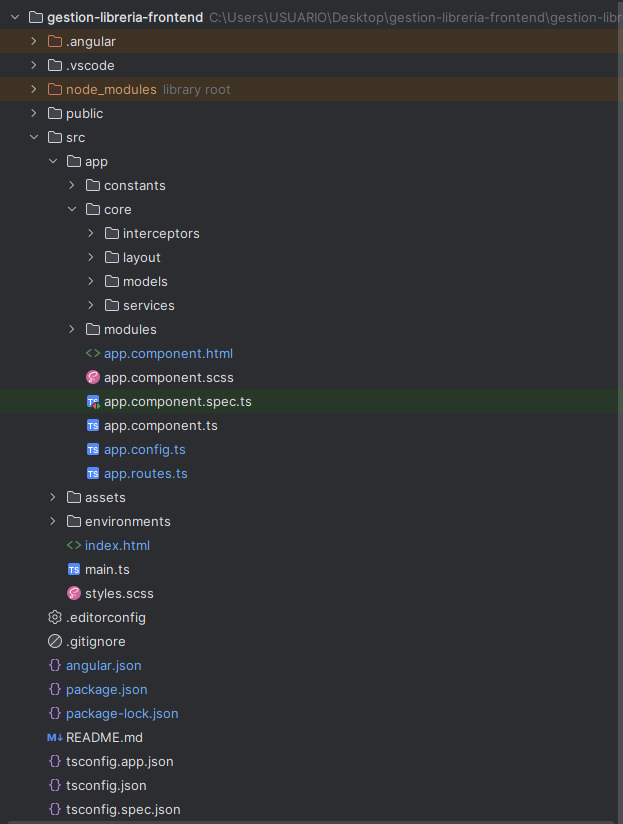
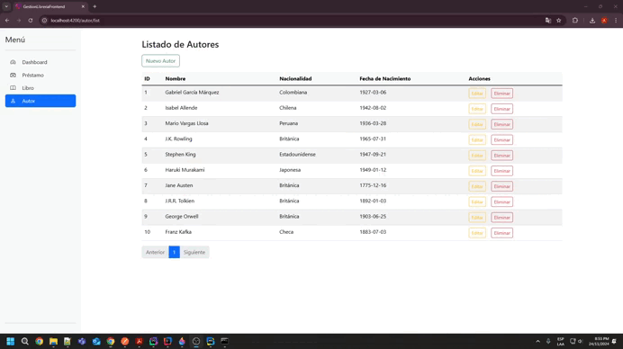
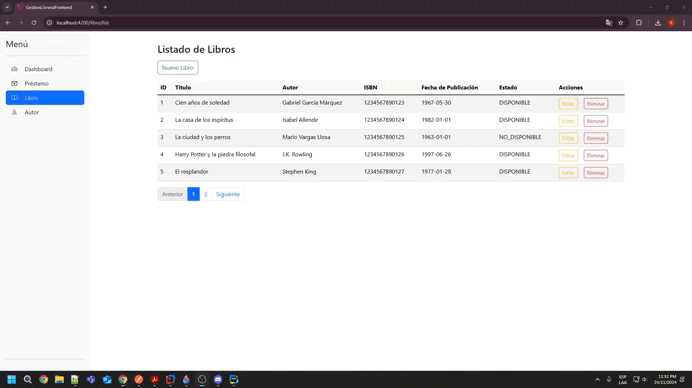
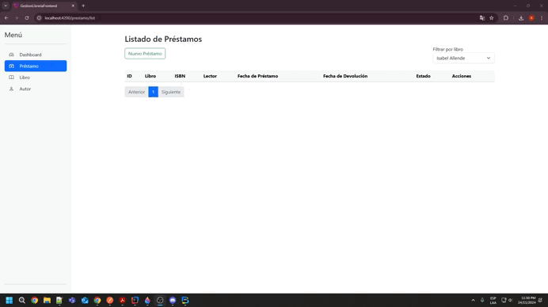

# 📚 Gestión de Librería Frontend

## Descripción del Proyecto

El proyecto **Gestión de Librería** es una aplicación web diseñada para gestionar libros, autores y préstamos en una biblioteca. Incluye funcionalidades como agregar, editar, eliminar y listar libros, autores y préstamos.

---

## 🛠️ Tecnologías Utilizadas

- **Framework:** Angular 18.2.0
- **Estilos:** Bootstrap 5.3.3
- **Librerías Adicionales:** Angular Reactive Forms
- **Editor Recomendado:** Visual Studio Code

---

## 🚀 Pasos para Ejecutar el Proyecto

#### **Requisitos Previos**
- **Node.js y NPM** instalado.
- **Angular CLI** instalado.

#### **Instrucciones**

1. Clona el repositorio:
   ```bash
   git clone https://github.com/AngeloQP/gestion-libreria-frontend.git

2. Instala las dependencias:
   ```bash
   npm install

3. Configurar url del backend en:
   ```bash
   src/environment/enviroment.ts

4. Ejecuta el proyecto en modo desarrollo:
   ```bash
   ng serve

5. Accede a la aplicación en el navegador:

   - **URL:** [http://localhost:4200](http://localhost:4200)


## 📁 Estructura del Proyecto





## 📸 Capturas de Pantalla

### **Dashboard**


### **Gestión de Autores**


### **Gestión de Libros**


### **Gestión de Prestamos**

